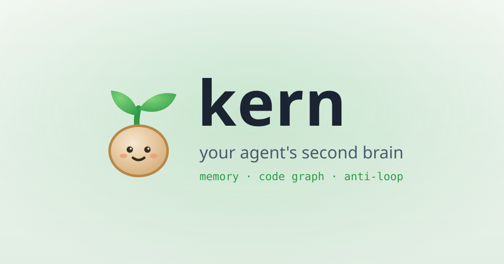
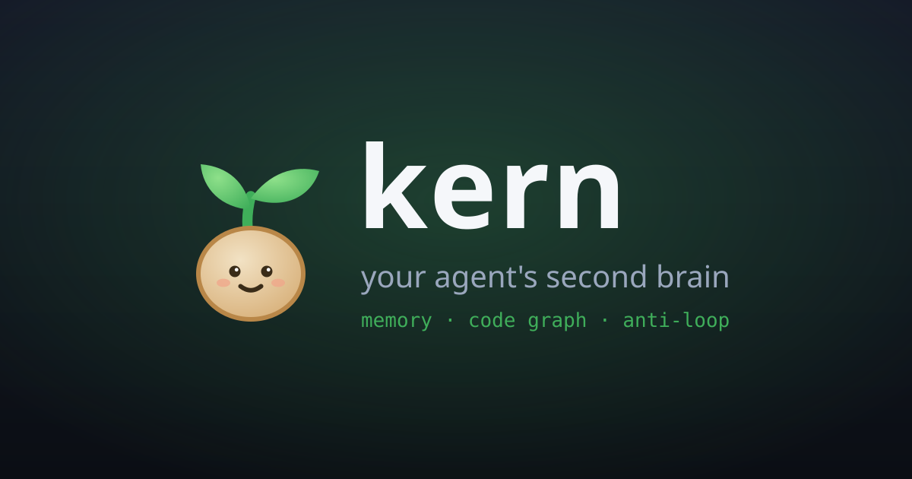

<p align="center">
  <a href="https://github.com/IdysisI/kern#gh-light-mode-only">
    
  </a>
  <a href="https://github.com/IdysisI/kern#gh-dark-mode-only">
    
  </a>
</p>

<p align="center">
  <a href="https://github.com/IdysisI/kern/releases"></a>
  <a href="https://github.com/IdysisI/kern/actions/workflows/tests.yml"></a>
  <a href="LICENSE"></a>
  
</p>

<h1 align="center">kern 🌱</h1>

<p align="center">
  <b>your coding agent's second brain.</b><br>
  a kernel is a seed — kern grows one into a little sprout that keeps your agent on track.
</p>

<p align="center">
  <a href="#-why">why</a> ·
  <a href="#-what-it-grows-into">what it does</a> ·
  <a href="#-install">install</a> ·
  <a href="#-using-it">usage</a> ·
  <a href="#-whats-inside">layout</a> ·
  <a href="docs/">docs</a>
</p>

---

## 🌱 Why

The model usually isn't the problem. The loop around the model is.

Left on its own, a coding agent reads the same file five times, forgets what it decided an hour ago, and loses its whole plan when the context window gets compacted. You've watched this happen. It's not a smarter model you need; it's a little bit of guardrails around the one you have.

Kern is that bit of guardrails. It's a small Python harness that runs the agent, watches for those exact failure modes, and gently keeps it on track. There's a terminal UI, a local web UI, and a desktop GUI, all talking to the same little daemon.

## 🌿 What it grows into

- **It notices loops.** A circuit breaker spots when the agent repeats the same action — same file, same command — and nudges it to try something else instead.
- **It knows your codebase.** A structural code graph (a plain AST pass, no LLM calls) answers "where is X?" and "what depends on Y?" without re-grepping everything.
- **It onboards itself.** First time in a repo, Kern writes a `KERN.md` with the stack, entry points, and test/build/lint commands. Your edits survive.
- **It keeps the plan.** A todo list survives compaction, so "what was I doing?" never gets lost.
- **It remembers.** After a turn, it writes what it learned to a local SQLite store and recalls the relevant bits next session.
- **It can clone itself.** Subagents fork off with their own session for parallel work; `isolate=true` runs one in its own git worktree so it can't step on your tree.
- **One-click sign-in.** `kern login github` uses the OAuth device flow. No SSH keys, no token pasting.

## 📦 Install

One command (Linux / macOS):

```bash
curl -fsSL https://raw.githubusercontent.com/IdysisI/kern/main/install.sh | bash
```

It clones the repo into `~/.local/share/kern`, installs the `kern` command with pipx if you have it (otherwise into its own little venv), and puts `kern` on your PATH. No sudo, doesn't touch your system Python. Re-run it anytime to update.

Prefer to do it by hand, or want to hack on the source?

```bash
git clone https://github.com/IdysisI/kern
cd kern
pip install -e .
kern
```

Kern talks to any OpenAI-compatible endpoint. Point it at yours:

```bash
export KERN_BASE_URL="http://localhost:8080/v1"   # ollama, vllm, llama.cpp, ...
export KERN_API_KEY="..."                          # whatever the endpoint expects
export KERN_MODEL="qwen3:8b"
```

It defaults to a local server on `http://localhost:8080/v1`.

## 🎮 Using it

```bash
kern            # terminal UI
kern web        # browser UI
kern gui        # desktop window
kern --task "refactor the auth module"   # headless; auto-approves actions
```

Handy slash commands once you're in: `/cost`, `/mount` and `/unmount` (skills), `/pause`, `/resume`, `/new`, `/quit`.

## 🗺️ What's inside

```
kern/
  engine.py     the agent loop
  context.py    compaction / folding
  memory.py     persistent memory (SQLite + FTS5)
  recall.py     memory retrieval
  codegraph.py  the structural code index
  syscalls.py   tools
  auth.py       github sign-in
  updater.py    hot self-update
  tui.py / web.py / gui.py    the three faces
```

## ⭐ Star history

<a href="https://www.star-history.com/?repos=IdysisI%2Fkern&type=date&legend=top-left">
 <picture>
   <source media="(prefers-color-scheme: dark)" srcset="https://api.star-history.com/chart?repos=IdysisI/kern&type=date&theme=dark&legend=top-left" />
   <source media="(prefers-color-scheme: light)" srcset="https://api.star-history.com/chart?repos=IdysisI/kern&type=date&legend=top-left" />
   
 </picture>
</a>

## 🌱 Status

It works and the tests are green, but it's still a sprout. Expect rough edges — and if you try it, tell me what breaks. Issues and PRs are very welcome.

If kern helps you, a star means a lot. 🌱

## 📜 License

[MIT](LICENSE)
